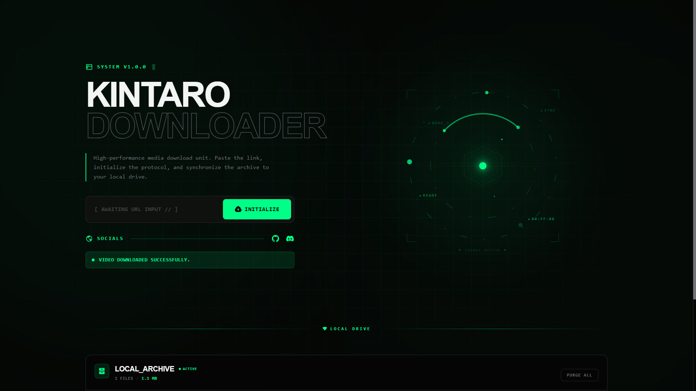
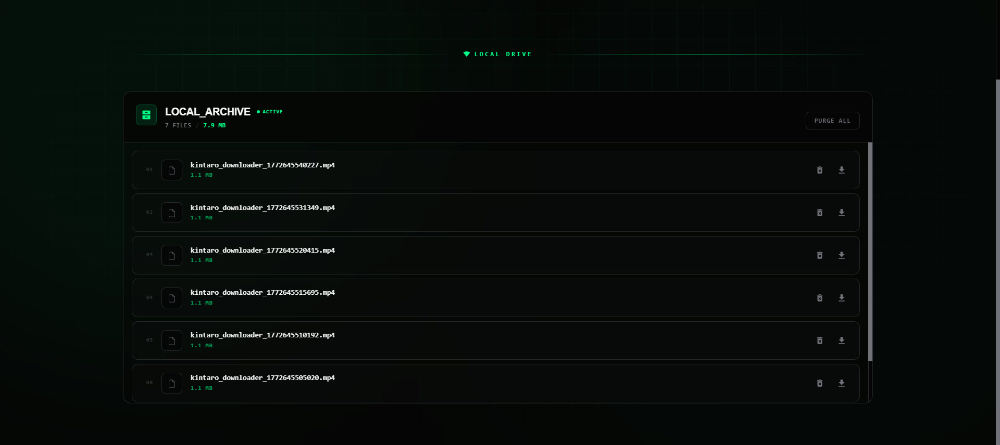
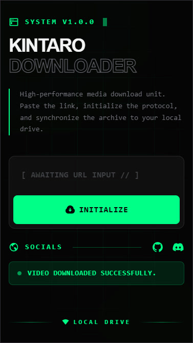

<div align="center">
  
  <br />
  <br />

  [](https://nodejs.org/)
  [](https://expressjs.com/)
  [](https://react.dev/)
  [](https://tailwindcss.com/)
  [](https://vitejs.dev/)
  [](https://github.com/yt-dlp/yt-dlp)

  <p align="center">
    <b>High-Performance Video Download Station</b>
    <br />
    Paste the link. Initialize the protocol. Archive locally.
    <br />
    <br />
    <a href="#features">Features</a> •
    <a href="#technologies">Technologies</a> •
    <a href="#installation">Installation</a> •
    <a href="#structure">Structure</a>
  </p>
</div>

---

## 📋 About

**Kintaro Downloader** is a self-hosted video download station with a cyberpunk-inspired interface. It wraps the power of [yt-dlp](https://github.com/yt-dlp/yt-dlp) in a sleek React frontend and an Express backend, letting you download videos from YouTube, TikTok, and hundreds of other platforms with a single click.

All downloads are saved locally on your machine — no cloud, no third-party servers. Just paste a URL, hit **Initialize**, and the video lands straight in your local archive.



## <a id="features"></a> ✨ Features

### ⬇️ Universal Video Downloading
- Supports **YouTube, TikTok, Twitter/X, Instagram, Reddit** and [hundreds more](https://github.com/yt-dlp/yt-dlp/blob/master/supportedsites.md) via yt-dlp.
- Automatically selects the **best available quality**.
- Downloads are saved with a timestamped filename for easy sorting.

### 📦 Local Archive Management
- Browse all downloaded files from the built-in **Local Archive** panel.
- View file names, sizes, and download dates at a glance.
- **Individual delete** or **Purge All** to clear the entire archive.
- Re-download any file directly from the archive list.

### 🎨 Cyberpunk UI
- **Dark glassmorphism** aesthetic with neon accent colors.
- Orbital animated visualizer on the landing section.
- Smooth **Framer Motion** transitions and micro-animations throughout.
- Fully responsive — works on desktop and mobile.

### 🔄 Auto-Updating
- yt-dlp binary is **automatically updated** on every server start to ensure maximum platform compatibility.

### 🛡️ Self-Hosted & Private
- Everything runs on **your own machine** or server. No data leaves your network.
- Simple `.env` configuration for ports and paths.
- Ready for **Docker** deployment out of the box.



## <a id="technologies"></a> 🛠️ Technologies

### Backend
- **[Node.js](https://nodejs.org/)** — JavaScript runtime for the server.
- **[Express](https://expressjs.com/)** — Minimal web framework for REST API endpoints.
- **[yt-dlp](https://github.com/yt-dlp/yt-dlp)** — Feature-rich command-line video downloader (via `yt-dlp-exec`).
- **[dotenv](https://github.com/motdotla/dotenv)** — Environment variable management.

### Frontend
- **[React 19](https://react.dev/)** — Component-based UI with the latest React features.
- **[Vite](https://vitejs.dev/)** — Lightning-fast build tool and dev server.
- **[Tailwind CSS v4](https://tailwindcss.com/)** — Utility-first CSS framework for rapid styling.
- **[Framer Motion](https://www.framer.com/motion/)** — Production-ready animation library.
- **[Axios](https://axios-http.com/)** — Promise-based HTTP client.
- **[React Icons](https://react-icons.github.io/react-icons/)** — Popular icon sets as React components.



## <a id="installation"></a> 🚀 Installation

### Requirements
- **Node.js** (v18+)
- **npm** (comes with Node.js)
- **yt-dlp** must be available in your system PATH, or the `yt-dlp-exec` package will handle it automatically.

### Step-by-Step Setup

1. **Clone the Repository:**
   ```bash
   git clone https://github.com/xkintaro/video-downloader.git
   cd video-downloader
   ```

2. **Install Backend Dependencies:**
   ```bash
   cd backend
   npm install
   ```

3. **Install Frontend Dependencies:**
   ```bash
   cd ../frontend
   npm install
   ```

4. **Configure Environment Variables:**

   **Backend** (`backend/.env`):
   ```env
   VITE_BACKEND_PORT=5066
   VITE_DOWNLOADS_DIR=downloads
   ```

   **Frontend** (`frontend/.env`):
   ```env
   VITE_FRONTEND_API_URL=http://localhost:5066
   VITE_DOWNLOADS_DIR=downloads
   VITE_FRONTEND_PORT=5065
   ```

5. **Start the Application:**

   **Option A — Using the batch script (Windows):**
   ```
   run.bat
   ```

   **Option B — Manual start:**
   ```bash
   # Terminal 1 — Backend
   cd backend && node index.js

   # Terminal 2 — Frontend
   cd frontend && npm run dev
   ```

6. Open `http://localhost:5065` in your browser to start downloading.

## <a id="structure"></a> 📂 Project Structure

```
kintaro-downloader/
├── backend/
│   ├── index.js               # Express server, API routes, yt-dlp integration
│   ├── package.json           # Backend dependencies
│   ├── .env                   # Backend environment config
│   └── downloads/             # Downloaded files directory (gitignored)
├── frontend/
│   ├── src/
│   │   ├── App.jsx            # Main application component
│   │   ├── index.css          # Global styles and design tokens
│   │   └── main.jsx           # React entry point
│   ├── public/                # Static assets (logos, icons)
│   ├── vite.config.js         # Vite configuration with API proxy
│   ├── package.json           # Frontend dependencies
│   └── .env                   # Frontend environment config
├── run.bat                    # Windows batch script to start both services
├── run-kintaro-downloader.vbs # Windows silent startup script
└── README.md
```

---

<p align="center">
  <sub>❤️ Developed by Kintaro.</sub>
</p>
